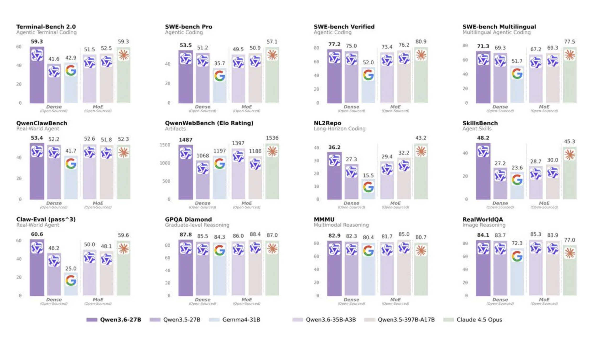

# Go Local or Go Broke!

If you read this be warned! A cost avalanche is about to hit you. 

You're vibing away with coffee in hand, poking the Claude or Copilot agent – then suddenly – you get a warning that your daily quota limit is at 50% and resets after lunch. At 10am? A few weeks later you swear that your premium requests ran out faster than usual. Didn't you easily get through the month before?

Claude Code discontinued on the $20/mo plan and low daily quotas to push direct API pricing cost for premium models are ahead of us.

Reclaim your tools. Stop being dependent on 

> Just here for the goods? Docker compose files can be found on [GitHub](https://github.com/philippjbauer).

## What's happening to my subscription?

The subscription model for AI models is collapsing. It was quiet at first, now we hear the horns beyond the hill. It doesn't take an economist to see that subsidizing subscriptions by 10–100x their monthly cost isn't sustainable.

The tech industry is fixated on the premise that AI is the panacea to all productivity problems. As developers we feel the squeeze to use LLMs now – some are "encouraged" to use it as part of an arbitrary KPI to hit. The big AI companies are still dangling the promise of AGI in front of an audience with waning enthusiasm.

They have to. Somehow they need to become profitable. Now you have the chance to say …

## "No thank you, Sam."

Over the last three years, other vendors have steadily kept up with OpenAI and Anthropic. Today, small models that run reasonably fast on consumer hardware match flagship model's capabilities from half a year ago.

If you use these models as a tool that executes on your thinking and skill – augmenting you instead of trying to replacing you – then now is the time to build your own, private and secure infrastructure at home or on your laptop.

## What has changed?

Unlike their western "Open" AI counterparts, models from China and Europe have been made freely available to the public for a years. Yes, after many years OpenAI finally released an open-weight model. But in a market that advances every 3 months it quickly went stale.

### Models

Replacing its very capable predecessor, Qwen3.6 has been released just a short while ago and immediately passed my personal sniff test. I'm talking specifically about the `35B A3B` variant. A capable mixture of experts model that according to their own benchmarking – and yes, take them with a grain of salt – is on-par with their own `3.5 397B A17B` model. But the headline for me is: **it's in spitting distance to `Claude Opus 4.5`!** If you need even better performance go with its dense 27B parameter sibling.

<iframe src="../assets/posts/coding_benchmarks_comparison.html" width="100%" height="600" title="Coding benchmarks comparison"></iframe>

### Open Source Advancements

The second big change are the latest versions of Open WebUI. A replacement for OpenAI's ChatGPT interface. More on that later.

## AI APIocalypse what?

You might have not been following the investment story behind our great "benefectors" that sell us our helpers for so little money. But it's the same old play we've seen before. Netflix, cheap streaming – went costly and enshittified over time. We are currently experiencing the fixing phase of Big AI's strategy. Hook as many people onto their product as possible. Uber did the same thing. Heavily subsidized fares to become the popular option and capture the market. Then jack up the price. Same story, again and again. 

If you paid your Copilot usage in API pricing you'd have a $2,000 hole in your pocket each month.

## Great now what?

That $2,000 is exactly the kind of money you need to show Big AI that you rather have control over your tool. No suprise changes in the system message. No dumbing down your tool during "peak hours" – that are conveniently all the time you're not sleeping.

Every **88 days** is the current pace of new model releases in the open-source / open-weight market. Each time bringing with it a new advancement in capabilities.

I've been advocating to not let the machines take over your engineering discipline. I think humans should be in charge of and responsible for the code AI tools generate. If you have spent a lifetime learning how to code, how to design systems and deploy them. When you know about the many edge cases that can arise and assumptions that have to be checked during development. Then you know as well as I do that LLMs can't operate completely independently. They can amplify us – but not fully replace us.

This is a long-winded way of saying that – used with care and a capable guiding hand – local models can do what we were used to of frontier-models from a year ago. With more effiecient coding harnesses like Pi – rather than the token-slurping Claude Code – even better!

## Time to move into your own house

I'll make the bold assumption that you – as a developer, engineer or generally curious kind of person – are aware of what is happening with your personal data in our current online ecosystem. You will then – like I did – have shaken your head in bewilderment at how people are happily handing over their most sensitive and personal and company data to OpenAI's ChatGPT. Admitted, convenience is still king. The interface is seemless. But delivering yourself to the engine that has the singular goal of making money off of your data – for advertisement, for training new models? Sounds like a bad deal. Especially in the hands of a company that will be desperate to find ways to monetize themselves out of a hole tens of billions of dollars deep.

A company failing to make a profit and lots of sensitive data. Sounds a lot like **23 and Me** – your genetices commodified.

You can run all of this from home. And I've done most of the work for you!

So pack up and let's move.

## What you need

There are a few things that you will need before you get started. Let's have a look at them.

> You don't need to run your own LLMs right away. There is a middle ground. You can use services like OpenRouter, or host a GPU in the cloud to see how these models fit into your workflow. But we strive for independence here.

### Hardware

Simple, only 48G of VRAM

You might ask: _"Hold on how much?"_, but hear me out. The bar to enter is not that high anymore!

Yes, if you want raw speed, two Nvidia RTX 5090 24GB in a big watercooled tower and RGB lighting is a fancy thing to have. But for that I can rent a GPU for a long time. Also – thanks to data centers – we pay a lot more for energy these days. I don't need to run the A/C in the summer to cool a space-heater running at 1,000 W.

You can get your own local AI with a ~200W total system envelope for around $2,000. They have been talked about for a while now – and there are plenty of great tutorials on YouTube (e.g. by Kyuz) on how to set them up. I'm speaking of course about AMD's Ryzen AI 395+ Max or Strix Halo. They conveniently come with 96G and 128G unified RAM versions.

They come in many forms factors too. From laptop to desktop (Framework!) or even shoebox sized Mini-PCs. One of the latter I have in my networking closet. I like to have the machine available from anywhere.

But there's not only Nvidia and AMD. Apple's M-Series SoC is a worthwhile contender in this space. But you do pay a steep premium for RAM.

What matters in the end is a high memory bandwidth to the memory you have.

I have explained this in my 2024 CODE magazine article, so I won't go into the details here. [You’re Missing Out on Open-Source LLMs!](https://codemag.com/Article/2403041/You%E2%80%99re-Missing-Out-on-Open-Source-LLMs!) – _CODE Magazine, March/April 2024_

### Services

> Is this the ad read? Who's this guy working for …

**Staying anonymous with a VPN**

I won't tell you who to choose, because VPN providers are hotly debated. But if you don't already have one – get a VPN. You'll need it later to run your search and LLM agent's traffic so it's not your IP that gets caught in a bot list.

But more importantly: this is about independence as much as it is about keeping your data private.

**A step up from local models**

Sometimes the local AI is not enough. There is no shame in using APIs. If you do need that extra bit of intelligence – go with services like OpenRouter or rent a GPU services. Large frontier models exist outside of Anhtropic and OpenAI. Up to 1T parameter models are a thing there too. GLM, MiniMax and the larger Qwen models are all very capable. And way more affordable than their US counterparts.

Data sharing is handled granulary and there are providers that don't save any data for longer than needed to fulfill your request. Renting and spinning up a model on your rented GPU may be even cheaper depending on your use case. Per 1 million token pricing vs. hourly GPU pricing can favor rented GPUs for long running, continuous agent tasks.

### Software

