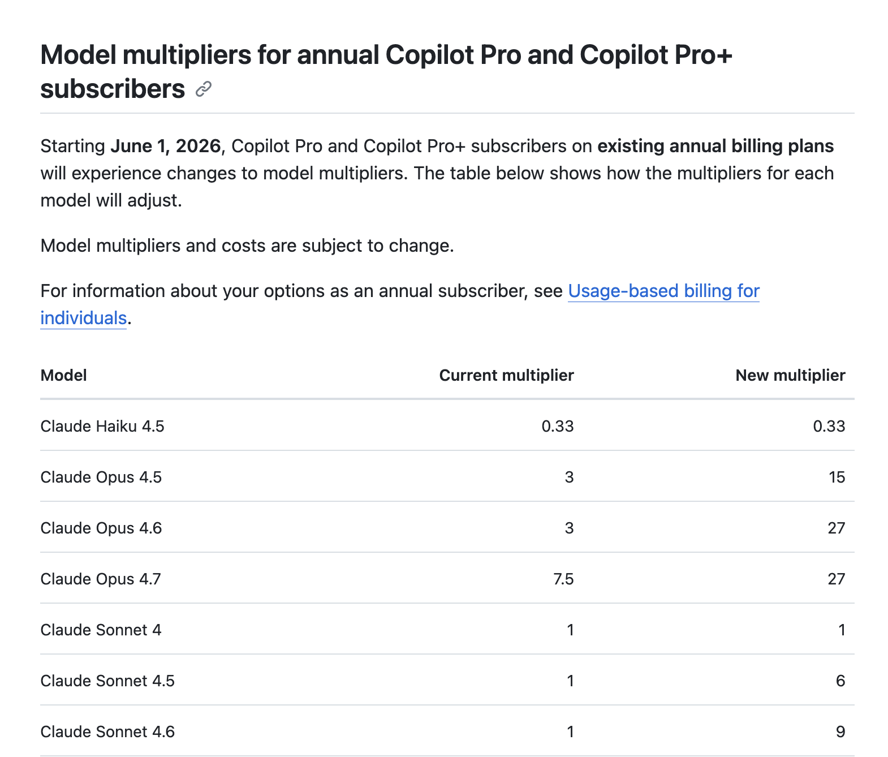
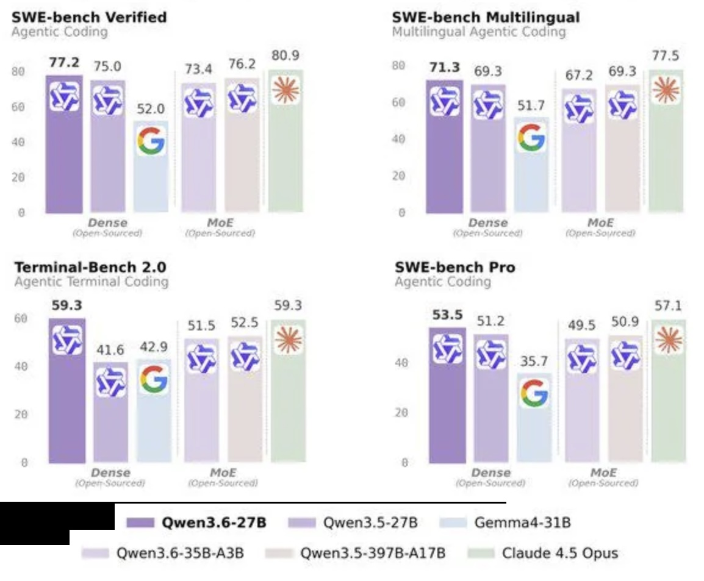
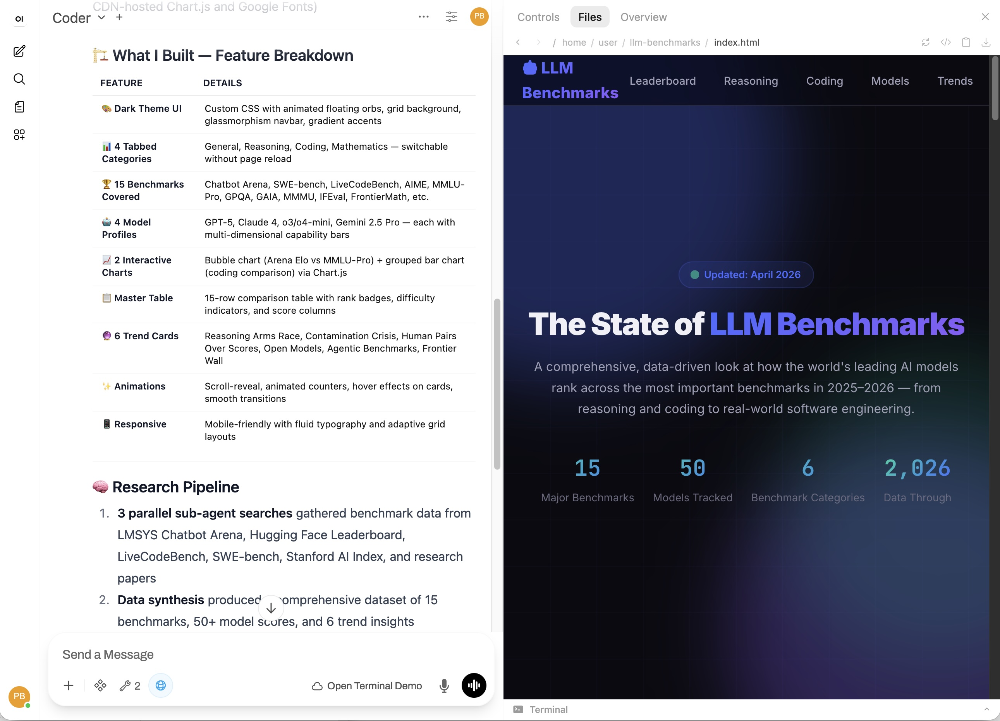
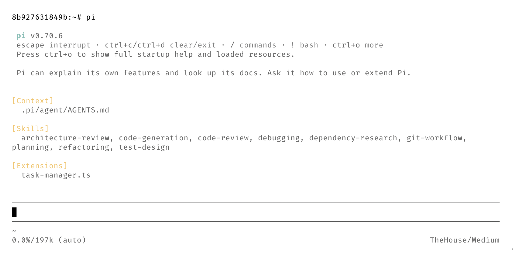
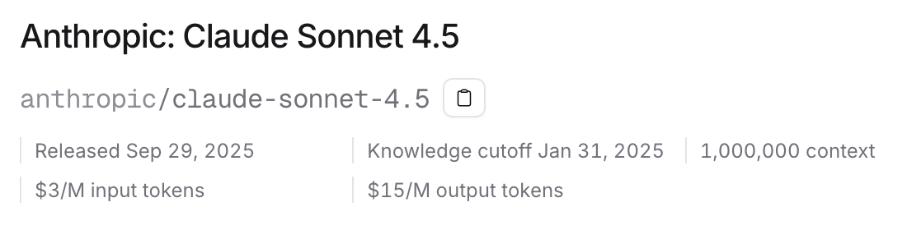
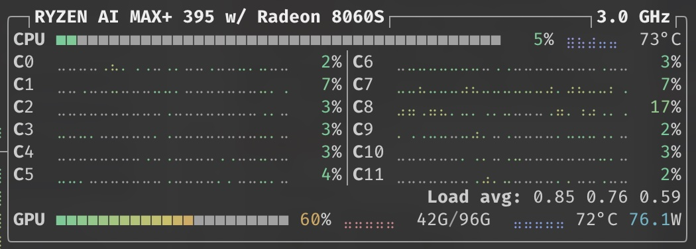

## Your coding agent just got more expensive

You're vibing away with coffee in hand, poking the Claude or Copilot agent – then suddenly – you get a warning that your daily quota limit is at 50% and resets after lunch. At 10am? A few weeks later you swear that your premium requests ran out faster than usual. Didn't you easily get through the month before?

Anthropic [tested removing Claude Code from its Pro plan](https://www.xda-developers.com/anthropic-cut-claude-code-new-pro-subscriptions/) – a signal of things to come – alongside [dwindling quotas](https://docs.github.com/en/copilot/reference/copilot-billing/models-and-pricing#model-multipliers-for-annual-copilot-pro-and-copilot-pro-subscribers) and [quiet changes to subscription plans](https://consumerrights.wiki/w/CursorAI_adds_rate_limits_to_unlimited_plans). The writing is already on the wall.

The answer isn't to pay more for worse service. It's to stop paying at all. Local AI has reached the point where you can run frontier-class models on your own hardware – private, predictable, and ultimately cheaper.

**Reclaim your tools! Stop being dependent on subscription services!**

> Just here for the goods? The privacy-first Open WebUI Docker Compose files can be found on [GitHub](https://github.com/philippjbauer/privacy-open-webui-stack).

## The subscription model is collapsing

AI vendors in the US are struggling to make a profit from subscriptions. It was quiet at first, now we hear the horns from beyond the hill. It doesn't take an economist to see that subsidizing subscriptions by 10-100x their monthly cost isn't sustainable.

Reuters wrote this week, that:

> [OpenAI] CFO ​Sarah Friar has expressed concerns [...] that the ChatGPT creator **might not ​be able to pay for future computing contracts** ​if revenue doesn't grow fast enough, [...]\
> Source: [Reuters – 28th April, 2026](https://www.reuters.com/business/openai-falls-short-revenue-user-targets-it-races-toward-ipo-wsj-reports-2026-04-28/)

### It's the same old playbook

The story behind how AI companies are selling us our helpers for so little money is quite eye opening. I mean – a subscription to frontier models for $20/mo – I'll take that without asking too much.

But it's the same playbook we've seen before. Like every subscription service that was cheap and exciting, that was then enshittified over time.

The first phase – the one we're slowly departing from – hook as many people onto your product as possible. Just like Uber, they heavily subsidized prices to capture the market.

After people are familiar with the service and have become dependent, **they jack up the prices for the pro plans, reduce the quality and features of the entry plans and add advertisements for free plans**. The pricing for enterprise and API pricing will remain largely stable, paying for the subsidies and the subscription plans.

> \
> Source: [GitHub Copilot Billing Docs](https://docs.github.com/en/copilot/reference/copilot-billing/models-and-pricing#model-multipliers-for-annual-copilot-pro-and-copilot-pro-subscribers)

If you paid your Claude or Copilot usage in API pricing you'd have a $2,000+ hole in your pocket. Each month. You don't feel it because of the tens of billions flowing in from investors.

To compensate **we have already seen** the mentioned **price increases, features being cut and quotas tightened**.

> It's a risky plan in a volatile market and unpredictable global events.

### Does your data vanish with the company?

**Your data is in the hands of companies that are failing to make a profit.** And it is **most sensitive kind of data people can share**. Thoughts. Feelings. Secrets. Data that opens people up to immense harm should it somehow get into the wrong hands.

It carries the memories of 23 and Me and the controversy around the sale of customers' genetic data during their bankruptcy.

Now imagine if OpenAI is not able to create a return for investors that look to lose tens of billions of dollars.

**Who'll end up owning you?**

> \
>  Why not? — Sam Altman

## Local AI just leapt forward – what changed

Over the last three years, other vendors have steadily kept up with OpenAI and Anthropic. **Today, small models match flagship model's capabilities from half a year ago, and run fast enough on consumer hardware.**

Unlike their western "Open" AI counterparts, models from China and Europe have been made freely available to the public for a number of years. This month a new model release has changed local LLMs in a significant way. On top of that, open-source releases keep step on the tooling side.

### Qwen 3.6 – the 27B frontier-class

Replacing its very capable predecessor, [Qwen3.6](https://github.com/QwenLM/Qwen3.6) has been released just a short while ago. So far the Qwen3.6 35B A3B MoE and dense 27B variants have been released.

35B A3B is a very capable MoE model that according to their own benchmarking – and yes, take them with a grain of salt – is on-par with their previous Qwen3.5 397B A17B model! One tenth the size and **on-par or better than Claude Sonnet 4.5.**

But the headline for me, **a dense 27B model competing with Claude Opus 4.5!**

<blockquote>
 <br>
— Source: Alibaba / Qwen
</blockquote>

### Open WebUI: your local AI workspace

The second big change are the latest versions of Open WebUI. A replacement for OpenAI's ChatGPT interface. **It comes with tool calling, MCP and skills support. It can use memories, write notes and extract information from uploaded documents. It allows the use of sandboxed CLI environments, control headless browsers and can schedule automations for you.**

**Especially the automations** – prompts that are executed at configured intervals – are enabling some interesting use cases without needing to roll your own system.

<blockquote>
 <br>
 What is AGI, if not an LLM on a schedule?
</blockquote>

<small>(Their [license](https://github.com/open-webui/open-webui?tab=License-1-ov-file) should be read carefully though before you consider commercial use.)</small>

### Cut the bloat, keep the smarts

What happens when the people that sell you tokens, give you a tool that consumes them?

**They make sure it needs as many as possible.**

Every instruction, every gate to not break the user's system, everything that was put in place for people who want to YOLO their next SaaS – all of that are tokens YOU pay to process too! If you need them or not.

And then your custom agents' behavior changes because of an update to those instructions. Incredibly frustrating when you are used to deterministic tools.

But was it an update to your agent's harness? Was it because the same model is served quantized after lunch? **You can't know!** LLMs are unreliable enough in their own specific ways. With changing variables in the mix, you can't improve your workflow.

That's where bare-bones coding agent harnesses come in. Unopinionated, expandable, easy on the tokens. Projects like – or based on – [Pi Coding Agent](https://pi.dev).

> \
> Pi Coding Agent in Docker container

Pi is running on a terminal, has a small footprint and can be added to existing containerized dev environments.

### "No thank you, Sam."

If you use these models as a tool that executes on your thinking and skill – augmenting you instead of trying to replacing you – **then now is the time to build your own, private and secure infrastructure at home or on your laptop.**

Now you can say: "No thank you." to what Sam Altman and Dario Amodei have to offer.

## The capability moat is a lie

You have an escape hatch without too much hurt – today. What does the future look like?

In the Dec. 2024 paper ["Densing Law of LLMs"](https://arxiv.org/abs/2412.04315) by Chaojun Xiao et al., the authors describe that **the capability density of open-source base LLMs doubles approximately every 3.5 months**. This is due to the advancements in model architecture, better training techniques and data quality.

See the following example of a few select coding benchmarks across three generations of models. **Within about seven months, an open-source model is in a head-to-head race with Claude Sonnet 4.5. But not only that – it's likely only 1/10th of the frontier-model's size!**

<iframe src="../assets/posts/glogb/coding_benchmarks_comparison.html" width="100%" height="620" title="Coding benchmarks comparison" style="border: none; margin-bottom: 1rem;"></iframe>

### Hardware that pays for itself in a month

**If you need a simple argument that a ~$2,000 hardware investment beats continued API pricing:**

Look at Claude Sonnet 4.5 API costs [on OpenRouter](https://openrouter.ai/anthropic/claude-sonnet-4.5): `$3/M tokens in` / `$15/M tokens out` (in April '26)

> 

Get the napkin, let's do some math:

> **Step 1 – blended cost per million tokens:**\
> Typical AI agent usage has roughly an 8:1 input-to-output ratio.\
> Blended cost: `$3 + ($15 ÷ 8) = $4.90` ≈ **$5.00 per M tokens**\
> \
> At this rate, a **$2,000 hardware investment** buys you the same compute as:\
> `$2,000 ÷ $5.00 × 1,000,000 = 400,000,000 tokens`

But your input/output ratio will vary, caching helps, and not all models price the same.

Allow me to handwave a little bit 👋

> **Step 2 – how long does that last?**\
> Qwen3.6 35B A3B: ~600 tok/s processing, ~40 tok/s generation (approx., acknowledges long context)\
> Mixed throughput: `600 ÷ 8 + 40 = 115 tok/s`\
> \
> `400,000,000 tokens ÷ (115 tok/s × 60 × 60 × 24) = **~40.25 days**`

**If you used API pricing for continuous use, that single machine paid for itself in just over a month\*!**

And immediately you'll have control over your tools. Are insulated from surprise changes in system messages. And no one can dumb down your tools in the middle of your workday.

<small>\*remember my handwaving!</small>

## Choosing your local AI machine

I will give you my example, what worked for me. But you'll have to look at what you're doing and what your needs are. This part should inspire you to dig a little bit what new hardware is out there.

My M1 Pro with 32GB RAM has been with me for 5 years and still feels very capable. It has a high enough memory bandwidth to run some capable, small models. But Firefox alone hogs half of it, so I needed something to offload AI tasks to. For 90% of my use in Copilot, Claude Sonnet 4.5 was good enough for me. And I can wait a minute for something to complete. I don't necessarily need 150 token/sec throughput. I favored being able to run large 120B MoE models over speed and then also have remaining resources to run some VMs and containers.

You might want more parallel tasks or faster speeds. As so often, it depends.

> **A quick note:**\
> If you don't want to run your own LLMs right away, you can use services like OpenRouter, or host a GPU in the cloud. See how these models fit into your workflow first.\
>\
> But we strive for independence here.

The first computers I used barely had 128MB RAM. Big, beige clunkers on the desk. There was some kid-like glee holding a computer with 1,000 times the memory in your hands that is not a server.

> "640K ought to be enough for anybody!"\
> — (Not) Bill Gates

The rapid development of both models and hardware makes any "definitive" recommendation short-lived. This is meant as a starting place for your own research.

If you have a GPU to add to your build, 24 GB of video memory goes a long way.

But more is always better. You want more speed? Two Nvidia RTX 5090 24GB in a big watercooled tower is quite nice to have. And if you already like to game …

But that's money that can rent GPUs in the cloud for a long time. Also – thanks to data centers – we pay a lot more for energy these days. I don't need to run the A/C in the summer to cool a "space-heater" that itself cools 1,000W.

But! – **you can get your own local AI with a ~200W total system envelope for around $2,000.**

**AMD's Ryzen AI 395+ Max or Strix Halo with 96G and 128G unified RAM versions fitting 120B MoE models.** They have been talked about for a while now – and there are plenty of great tutorials on YouTube (e.g. by [Donato Capitella](https://www.youtube.com/@donatocapitella)) on how to set them up. They come as laptops, mini-pc and desktops.

But there's not only Nvidia and AMD. Apple's M-Series SoC is a good option in this space. But you do pay a steep premium for their higher RAM options.

What matters in the end is a high memory bandwidth to the memory you have.

I have explained this in my 2024 CODE magazine article, so I won't go into the details here: [You're Missing Out on Open-Source LLMs!](https://codemag.com/Article/2403041/You%E2%80%99re-Missing-Out-on-Open-Source-LLMs!). The hardware has of course advanced since.

**The essence is: don't go below 200GB/s memory bandwidth and no less than 48G usable VRAM.** At that point MoE models with 3-10B active parameters are fast enough for most live interactions. If you want to use dense models in the ~30B parameter territory look for 800GB/s+ bandwidth. With less bandwidth they still work for unattended processes that need more precision and less user input.

**And keep the Densing Law from earlier in mind! These machines will not have to be upgraded to run more capable models in the future.**

### Privacy and scaling with the cloud

#### Keeping your traffic private

I won't tell you who to choose, because VPN providers are hotly debated. Also, no one sponsors me.

**But if you don't already have one – get a VPN.**

You'll need it later to run your search and LLM agents' traffic through. So it's not your IP that potentially gets caught in a bot list. But more importantly: **this is about independence as much as it is about keeping your data private.**

#### Local first, cloud when needed

If you do need that extra bit of intelligence – you can go with services like OpenRouter or rent a GPU and host it yourself.

Large frontier-level models exist outside of Anthropic and OpenAI too. [Z.ai](https://huggingface.co/zai-org), [MiniMax](https://huggingface.co/MiniMaxAI) and the larger [Qwen](https://huggingface.co/Qwen) models are all very capable models. Try them on and see how they fit. They have more affordable API pricing than their US counterparts too!

**Data sharing is handled granularly, and there are providers that don't retain your data longer than needed to fulfill your request.** Renting and spinning up a model on your rented GPU may be even cheaper depending on your use case. Per 1 million token pricing vs. hourly GPU pricing can favor rented GPUs for long running, continuous agent tasks.

> You can run the setup without any 3rd party services. But I don't recommend it.

### Before you start: Docker and LLM servers

To run the compose file I have prepared **you'll need a host with Docker preinstalled.**

The details regarding how to prepare your system depend on the hardware you chose. Explaining all of that is beyond the scope of this article. You might want to get fancy and set up [Proxmox](https://www.proxmox.com/en/) to run multiple VMs and configure one of them to access the GPU.

**The Docker stack I composed does not include a service to run the LLM.** You'll need Docker installed first – see [Docker's install guide](https://docs.docker.com/engine/install/). Personally, I test different LLMs on a regular basis and don't want to have them entangled in this setup. You may choose differently. Commonly you'd use [llama.cpp](https://github.com/ggml-org/llama.cpp) or [vLLM](https://docs.vllm.ai/en/stable/deployment/docker/) to run models. Depending – again – on what hardware you choose. Nvidia, AMD and Apple all have individual requirements – each [GPU passthrough guide](https://docs.docker.com/desktop/gpu/) explains the specifics.

## Your privacy-first Open WebUI stack

The Open WebUI stack comes with integrated services including VPN, search, browser automation, and vector database. Over time I have honed this setup and combined everything in this comprehensive stack.

**This is a clean slate setup. No opinionated configurations or tools added. A starting point. Hook your LLM up, ask what tools the it can use to assist you and get building.** Open Terminal gives the agent a playground to create scripts that you can then use as tools for and in Open WebUI.

- **[Open WebUI](https://openwebui.com/)** – Web-based interface for LLMs
- **[WireGuard](https://www.wireguard.com/)** – Secure tunnel for all external traffic
- **[SearXNG](https://docs.searxng.org/)** – Privacy-focused search engine
- **[Playwright](https://playwright.dev/) (incl. MCP)** – Browser automation for web loading
- **[pgvector](https://github.com/pgvector/pgvector)** – PostgreSQL with vector extension for RAG
- **[Tika](https://tika.apache.org/)** – Content extraction service
- **[Open Terminal](https://github.com/open-webui/open-terminal)** – Web-based terminal access
- **Automated Backups** – Scheduled volume backups with encryption

#### Download the [privcay-first Open WebUI stack on GitHub](https://github.com/philippjbauer/privacy-open-webui-stack)

### Quickstart

**The repository includes a bash setup script that guides you through the creation of environment files.** It creates configuration files for SearXNG, pgvector and an envrionment file for the stack. **It's recommended to run this script on the Docker host machine.** Otherwise you'll have to copy the resulting files incl. the compose file manually to the Docker host.

The compose file is too long to show in full here. But the example `.env` file can give you an idea of what you'll need to configure the stack:

```env
# ─── Open WebUI Core ────────────────────────────────────────────────────────
# Secret key for session management. Generate with: openssl rand -hex 32
WEBUI_SECRET_KEY=your-secret-key-here-32-characters

# ─── Network / Port Configuration ───────────────────────────────────────────
# Port Open WebUI exposes on the host (mapped to container port 8080)
OPENWEBUI_PORT=4040

# Port SearXNG exposes on the host (mapped to container port 8080)
SEARXNG_PORT=4041

# Port Playwright Server exposes on the host (mapped to container port 8931)
PLAYWRIGHT_SERVER_PORT=4042

# Port Playwright MCP exposes on the host (mapped to container port 8932)
PLAYWRIGHT_MCP_PORT=4043

# Port Open Terminal exposes on the host (mapped to container port 8933)
OPEN_TERMINAL_PORT=4044

# ─── SearXNG Configuration ──────────────────────────────────────────────────
# Base URL for SearXNG (must match your network topology)
SEARXNG_BASE_URL=http://ip-or-domain-of-your-docker-host:4041/

# ─── WireGuard VPN ─────────────────────────────────────────────────────────
# VPN credentials (provided by your VPN provider)
WIREGUARD_PRIVATE_KEY=your-wireguard-private-key
WIREGUARD_ADDRESSES=10.8.0.2/32
VPN_ENDPOINT_IP=vpn.your-provider.com
VPN_ENDPOINT_PORT=51820
WIREGUARD_PUBLIC_KEY=your-wireguard-public-key
WIREGUARD_PRESHARED_KEY=your-preshared-key

# DNS servers inside VPN tunnel
DNS_SERVERS=1.1.1.1,1.0.0.1

# ─── pgvector / PostgreSQL ─────────────────────────────────────────────────
# Database credentials
PGVECTOR_DB=openwebui
PGVECTOR_USER=openwebui
PGVECTOR_PASSWORD=your-pgvector-password-here

# ─── Open WebUI Data Paths ─────────────────────────────────────────────────
# Local paths for persistent data storage
OPEN_WEBUI_DATA_PATH=open-webui-data
PGVECTOR_DATA_PATH=pgvector-data
PGVECTOR_CONFIG_DIR=pgvector
SEARXNG_CONFIG_DIR=searxng
PLAYWRIGHT_MCP_DATA_PATH=playwright-mcp-data

# ─── External Service Endpoints ─────────────────────────────────────────────
# WebSocket endpoint for Playwright server (used by Open WebUI for web loading)
PLAYWRIGHT_WS_ENDPOINT=ws://ip-or-domain-of-your-docker-host:4042

# Tika server URL (used by Open WebUI for content extraction)
TIKA_SERVER_URL=http://tika:9998

# ─── Open Terminal ─────────────────────────────────────────────────────────
# API key for Open Terminal service
OPEN_TERMINAL_API_KEY=your-open-terminal-api-key

# ─── Optional: RAG Tuning ──────────────────────────────────────────────────
# Chunk size target for document processing (words)
# CHUNK_MIN_SIZE_TARGET=1000

# ─── Optional: Database Pool Sizing ────────────────────────────────────────
# Adjust if you experience QueuePool limit reached errors
# DATABASE_POOL_SIZE=10
# DATABASE_POOL_MAX_OVERFLOW=10

# ─── Backup Configuration ──────────────────────────────────────────────────
# Local path for backup archive destination
BACKUP_LOCAL_PATH=./backups

# Encryption (optional but recommended)
BACKUP_ENCRYPTION_METHOD=gpg
BACKUP_ENCRYPTION_PASSPHRASE=your-encryption-passphrase

# SSH/SCP remote backup (disabled by default – uncomment and configure as needed)
# BACKUP_SCP_HOST=your-backup-server
# BACKUP_SCP_USER=backup-user
# BACKUP_SCP_PATH=/home/backup-user/docker-backups
# SSH_IDENTITY_FILE=./ssh.key
```

## Running Qwen3.6 on AMD Strix Halo

Let's assume you have an AMD Strix Halo machine set up and the GPU configured to be usable by Docker. **The following demonstrates a tested configuration to run the aforementioned Qwen3.6 35B A3B model on this machine.**

> \
> `btop` showing current CPU / GPU usage

My personal setup uses 96/128G for VRAM and the remaining 32G RAM are split between Docker host VMs. One of them hosts the llama.cpp server and several other loads. You can see here that **the model uses about 40G VRAM with its full context size of 256k tokens.**

The rest of the used VRAM is used by a small model for title and follow up question generation in Open WebUI. I recommend something a current, small model like Qwen3.5 2B for example. Configured with enough context to handle long conversations for title requests.

### Llama.cpp Server Compose for AMD Strix Halo

```yaml
services:
  llamacpp:
    image: docker.io/kyuz0/amd-strix-halo-toolboxes:vulkan-radv
    container_name: llama-vulkan-3001
    ports:
      - "3001:8080"
    environment:
      # Networking
      - LLAMA_ARG_HOST=0.0.0.0
      - LLAMA_ARG_PORT=8080
      
      # Hugging Face model configuration
      - HF_TOKEN=${HF_TOKEN}  # Set this in your .env file or export it – get one from [Hugging Face](https://huggingface.co/docs/hub/en/security-tokens)
      - LLAMA_ARG_HF_REPO=${HF_REPO:?LLAMA_ARG_HF_REPO is missing required value}
      - LLAMA_ARG_ALIAS=${LLAMA_ARG_ALIAS}
      - LLAMA_ARG_TEMP=${LLAMA_ARG_TEMP:-0.7}
      - LLAMA_ARG_TOP_P=${LLAMA_ARG_TOP_P:-0.95}
      - LLAMA_ARG_TOP_K=${LLAMA_ARG_TOP_K:-40}
      - LLAMA_ARG_MIN_P=${LLAMA_ARG_MIN_P:-0.01}
      - LLAMA_ARG_REPEAT_PENALTY=${LLAMA_ARG_REPEAT_PENALTY:-1.0}
      - LLAMA_ARG_PRESENCE_PENALTY=${LLAMA_ARG_PRESENCE_PENALTY:-1.0}
      
      # Context and GPU configuration
      - LLAMA_ARG_CTX_SIZE=${LLAMA_ARG_CTX_SIZE}
      - LLAMA_ARG_N_PARALLEL=${LLAMA_ARG_N_PARALLEL}     # Run n parallel tasks (task context size: CTX_SIZE/n)
      
      # Performance tuning
      - LLAMA_ARG_N_GPU_LAYERS=-1  # Offload all layers to GPU
      - LLAMA_ARG_N_THREADS=4      # Adjust based on your CPU cores
    volumes:
      - /mnt/archives/llama.cpp:/root/.cache/llama.cpp  # Cache llama.cpp models
      - /mnt/archives/huggingface/hub:/root/.cache/huggingface/hub  # Cache HF models
    devices:
      - /dev/kfd
      - /dev/dri
    group_add:
      - video
    security_opt:
      - seccomp:unconfined
    ipc: host
    restart: unless-stopped
    command: >
      llama-server 
      -fa 1
      --mlock -cram 8192
      -ctk q8_0 -ctv q8_0 
      -ctxcp 128 --checkpoint-every-n-tokens 2048
      --batch-size 2048 --ubatch-size 1024
      --spec-type ngram-mod --spec-ngram-size-n 24 
      --draft-min 12 --draft-max 64
      --reasoning on
      --chat-template-kwargs '{"preserve_thinking":true}'
```

#### Llama.cpp Server options explained

<div class="table-wrapper">

<table>
<colgroup>
  <col class="option-col">
  <col class="value-col">
</colgroup>
<thead>
<tr>
<th>Option</th>
<th>Explanation</th>
</tr>
</thead>
<tbody>
<tr>
<td><code>-fa 1</code></td>
<td>Enable Flash Attention (1 = on); reduces KV cache memory usage and speeds up attention computation</td>
</tr>
<tr>
<td><code>--mlock</code></td>
<td>Pin model weights in RAM to prevent OS swapping, reducing latency spikes from disk I/O</td>
</tr>
<tr>
<td><code>-cram 8192</code></td>
<td>Set maximum cache-ram (context RAM) to 8192 MiB for KV cache allocation across slots</td>
</tr>
<tr>
<td><code>-ctk q8_0 -ctv q8_0</code></td>
<td>Quantize KV cache key and value tensors to Q8_0 precision to save VRAM while retaining quality</td>
</tr>
<tr>
<td><code>-ctxcp 128</code></td>
<td>Set context checkpoints (SWA checkpoints) to 128 per slot, enabling faster context recycling</td>
</tr>
<tr>
<td><code>--checkpoint-every-n-tokens 2048</code></td>
<td>Create a KV cache checkpoint every 2048 tokens during prefill for faster restart/reuse</td>
</tr>
<tr>
<td><code>--batch-size 2048</code></td>
<td>Set logical maximum batch size to 2048 tokens for concurrent sequence scheduling</td>
</tr>
<tr>
<td><code>--ubatch-size 1024</code></td>
<td>Set physical maximum batch size to 1024 tokens (actual computation batch sent to GPU/CPU)</td>
</tr>
<tr>
<td><code>--spec-type ngram-mod</code></td>
<td>Use n-gram modified speculative decoding (no draft model needed, uses context-based hash lookup)</td>
</tr>
<tr>
<td><code>--spec-ngram-size-n 24</code></td>
<td>Set n-gram size to 24 for the ngram-mod speculative decoder (longer matches = better accuracy)</td>
</tr>
<tr>
<td><code>--draft-min 12</code></td>
<td>Set minimum draft tokens to 12 for speculative decoding (prevents tiny speculative batches)</td>
</tr>
<tr>
<td><code>--draft-max 64</code></td>
<td>Set maximum draft tokens to 64 for speculative decoding (caps speculative lookahead)</td>
</tr>
<tr>
<td><code>--reasoning on</code></td>
<td>Force reasoning/thinking mode: always extract and display model's chain-of-thought output</td>
</tr>
<tr>
<td><code>--chat-template-kwargs '{"preserve_thinking":true}'</code></td>
<td>Pass <code>preserve_thinking=true</code> to chat template; required for Qwen3.5/3.6 thinking models to retain content from thinking blocks</td>
</tr>
</tbody>
</table>

</div>


### Environment file example

```conf
# Environment Variables
# These variables will be available to your project services
# Format: VARIABLE_NAME=value

# Huggingface
HF_TOKEN="hf_[truncated]"

# Active models
HF_REPO="unsloth/Qwen3.6-35B-A3B-GGUF:Q8_0"  # Quantized on [Unsloth](https://unsloth.ai/)

# Coding Tasks w/ Thinking
LLAMA_ARG_ALIAS="Qwen3.6-35B-A3B"
LLAMA_ARG_TEMP=0.6
LLAMA_ARG_TOP_P=0.95
LLAMA_ARG_TOP_K=20
LLAMA_ARG_MIN_P=0.0
LLAMA_ARG_REPEAT_PENALTY=1.0
LLAMA_ARG_PRESENCE_PENALTY=1.0
LLAMA_ARG_N_PARALLEL=2
LLAMA_ARG_CTX_SIZE=262144

# # General Tasks w/ Thinking
# LLAMA_ARG_ALIAS="Qwen3.6-35B-A3B"
# LLAMA_ARG_TEMP=1
# LLAMA_ARG_TOP_P=0.95
# LLAMA_ARG_TOP_K=20
# LLAMA_ARG_MIN_P=0.0
# LLAMA_ARG_REPEAT_PENALTY=1.0
# LLAMA_ARG_PRESENCE_PENALTY=1.1
# LLAMA_ARG_N_PARALLEL=3
# LLAMA_ARG_CTX_SIZE=262144
```

## Machines amplify us – they don't replace us

I've been advocating to not let the machines take over your engineering discipline. **Humans should be in charge of and responsible for the code AI tools generate.**

If you have spent a lifetime learning how to code, how to design systems and deploy them. When you know about the many edge cases that can arise in systems. When you experienced how only the right questions – not assumptions – lead to good project outcomes. Then you know as well as I do that **LLMs can't operate completely independently. They can amplify us – but not fully replace us.**

**Used with care and a capable guiding hand local models can do what we were used to of frontier-models.** With more efficient coding harnesses like Pi – rather than the token-slurping Claude Code – even better!

Not only do we insulate ourselves from a significant increase in prices at the token pump.

But you can also make as statement that you don't want:

- **to be part of another bait-and-switch subscription,**
- **to let companies change how your tools work based on the time of day,**
- **to hand over your private data, for model training or to sell you stuff.**

But instead you send a signal that you want:

- **predictability and control over your tools and what powers them,**
- **the choice of when and how someone else processes your data,**
- **alternatives to closed-source models from big AI companies with uncertain futures.**
